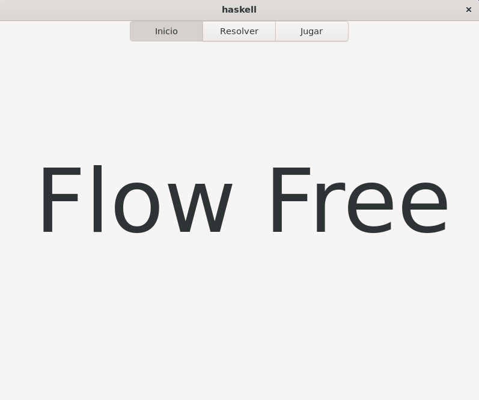
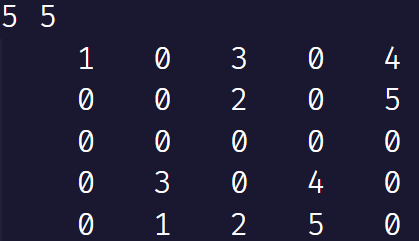
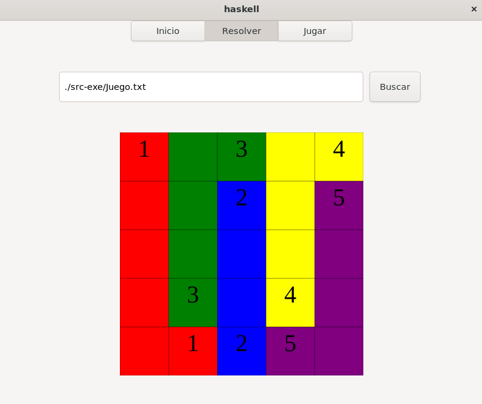

# Aplicación FlowFree

Esta aplicación resuelve tableros de FlowFree además de ofrecer 3 tableros para que el usuario juegue.

## Uso

Para usar la aplicación, debe ejecutar `main.sh` si está en Linux o `main.bat` si está en Windows.

Todos los ficheros fuente o recursos se encuentran en la carpeta [src-exe](src-exe/), las demás carpetas contienen archivos de la compilación de la aplicación.

Para resolver un tablero, deberá especificar la ruta de un fichero con un tablero con el siguiente formato.

Una vez lo haya indicado, solo presione el botón de resolver.

Para jugar, debe escribir en la celda el número que corresponde con el color que desea colocar. Una vez haya terminado, presione el botón de resolver para ver si la solución es correcta.

## Autores

Este proyecto ha sido realizado por:

- Gabriel Suarez
- Angela Gutierrez