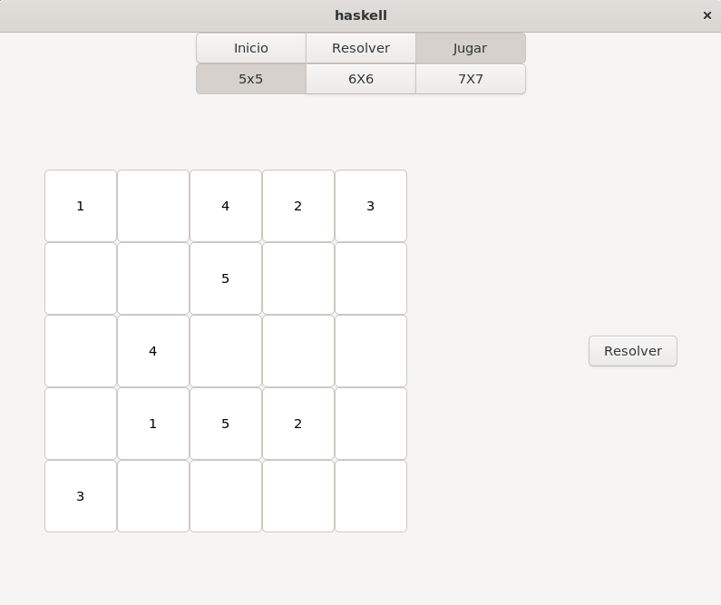

# Aplicación FlowFree

Esta aplicación resuelve tableros de FlowFree además de ofrecer 3 tableros para que el usuario juegue.

## Uso

Para usar la aplicación, debe ejecutar `main.sh`.

Todos los ficheros fuente o recursos se encuentran en la carpeta [src-exe](src-exe/), las demás carpetas contienen archivos de la compilación de la aplicación.

Para resolver un tablero, deberá especificar la ruta de un fichero con un tablero con el siguiente formato:

Una vez lo haya indicado, solo presione el botón de Buscar.

Para jugar, debe escribir en la celda el número que corresponde con el color que desea colocar. Una vez haya terminado, presione el botón de Resolver situado a la derecha del tablero para ver si la solución es correcta.

## Método de resolución

Para resolver un tablero de FlowFree se ha optado por modelar el juego como un Problema de satisfacibilidad booleana (SAT) para luego usar un solucionador existente de este problema. Tomamos inspiración del blog [Flow Free redux: eating SAT-flavored crow](https://mzucker.github.io/2016/09/02/eating-sat-flavored-crow.html) de Matt Zucker para abordar la modelización del problema y usamos el solucionador SAT en Haskell [Surely](https://github.com/gatlin/surely/tree/master) de Gatlin Johnson

## Autores

Este proyecto ha sido realizado por:

- Gabriel Suárez
- Ángela Gutiérrez
